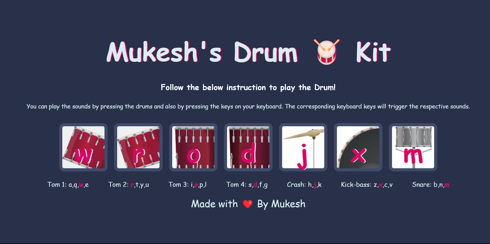

# Mukesh's Drum 🥁 Kit



Welcome to Mukesh's Drum Kit project! This interactive website allows you to play the drums using either your mouse or keyboard. It's a fun and engaging way to explore your musical talent!

## Responsive Design

Mukesh's Drum 🥁 Kit is designed to be fully responsive, ensuring a seamless experience across various devices and screen sizes. Whether you're using a desktop computer, laptop, tablet, or smartphone, the drum kit will adapt and function optimally.

## How to Play

1. You will see a set of drum pads displayed on the screen.
2. To play the drums, you have two options:
   - **Option 1: Mouse Interaction**
     - Click on any drum pad to trigger the corresponding sound.
   - **Option 2: Keyboard Interaction**
     - Press the keys on your computer keyboard that are labeled on the drum pads.
     - Each key corresponds to a specific drum sound.
3. Enjoy creating your drum beats and rhythms by experimenting with different drum pad combinations!

## Technologies Used

- HTML
- CSS
- JavaScript

## Getting Started

To run the Drum Kit project locally on your machine, follow these steps:

1. Clone the repository to your local machine using the following command:
   ```
   git clone https://github.com/mukeshkc123/drum_kit.git
   ```
2. Navigate to the project directory:
   ```
   cd drum_kit
   ```
3. Open the `index.html` file in your preferred web browser.

That's it! You should now see the Drum Kit website on your browser and be able to start playing the drums.

## Contributing

Contributions are always welcome! If you have any suggestions, improvements, or bug fixes, please feel free to contribute to this project. Here's how you can get involved:

1. Fork the repository on GitHub.
2. Clone your forked repository to your local machine.
3. Make your desired changes.
4. Commit and push your changes to your forked repository.
5. Submit a pull request explaining your changes.

Please ensure that your contributions align with the project's coding standards and follow the existing file structure.

If you have any suggestions or feedback, please feel free to reach out. Thank you for visiting Mukesh's Drum 🥁 Kit!
